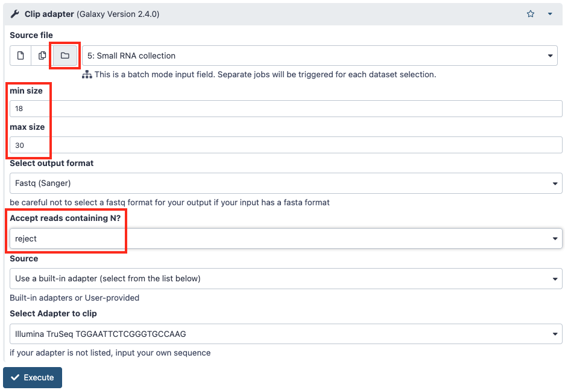
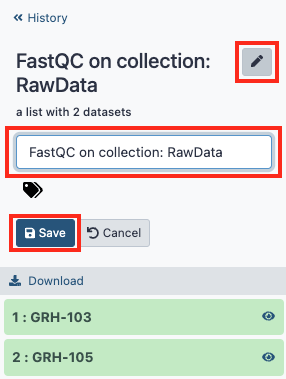
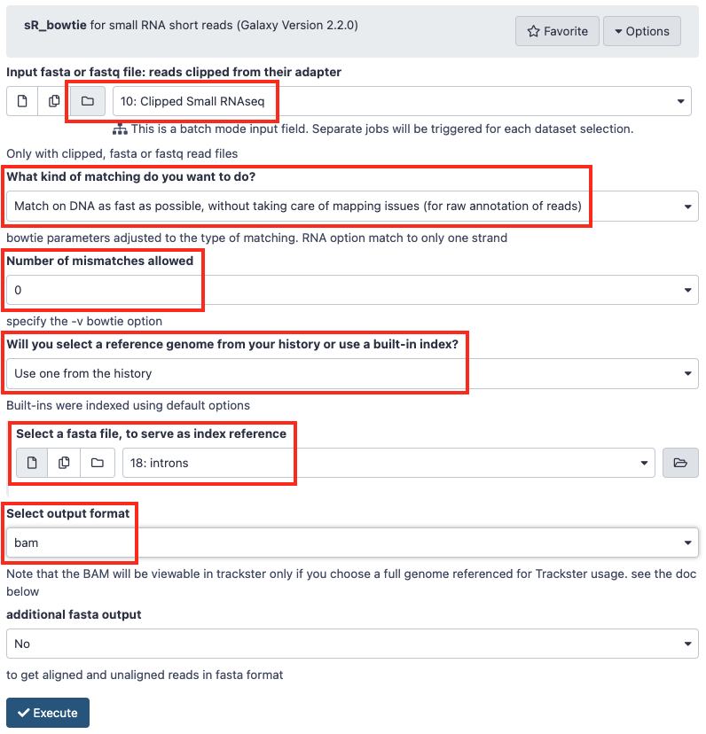
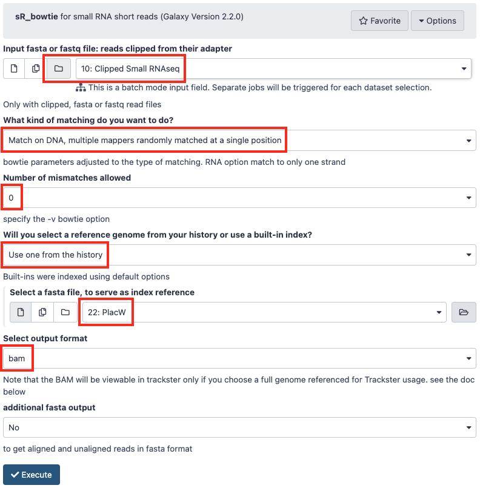

# 1. Traitement des données des petits ARN

!!! attention "Objectif"

	Le but de cette séance de Travaux Pratiques est d’effectuer le traitement des données du séquençage des petits ARN.
	
	À la fin de la séance vous devez pouvoir comparer les profils d’expression des petits ARN dans les différentes conditions d’étude.

!!! hint ""

	Les questions posées tout au long de cette page sont là pour vous guider dans votre analyse, pour vous aider à comprendre ce que vous faites et ainsi mieux appréhender vos résultats. Elles ne sont en aucun cas la base de l’évaluation de votre travail.

Vous allez partir de l'historique que vous avez créé hier où se trouve la collection des données de séquençage des petits ARN GRH-103 et GRH-105 ([voir le tutoriel](https://artbio.github.io/startbio/AnalyseGenomes_2022/Loading_data_in_galaxy/#5-dataset-collections)).

--------------------------------------------------------------------------------
## Contrôle qualité des lectures

!!! note "FastQC"

	Pour afficher plusieurs graphiques permettant d’évaluer de façon automatique la qualité des lectures obtenues, nous allons utiliser le logiciel **FastQC**. Il est disponible sur les principaux systèmes d’exploitation actuels (Windows, MacOS et Linux) et peut-être utilisé avec une interface graphique ou bien en ligne de commande. Vous pouvez télécharger l'outil et consulter son mode d’emploi [sur son site internet](https://www.bioinformatics.babraham.ac.uk/projects/fastqc/)

Dans Galaxy vous allez utiliser l’outil ***FastQC Read Quality reports***. Pensez à cliquer sur l'icône en forme de dossier pour accéder à votre collection.

Cliquer sur "Execute" sans modifier les paramètres.

Si aucune image ne s'affiche, rendez-vous dans les [annexes](./annexes.md#resoudre-les-problemes-daffichage-html-dans-galaxy) pour résoudre ce problème.

En vous aidant de la notice d’utilisation du logiciel, regardez les résultats du contrôle de qualité effectué par FastQC sur votre fichier fastq.

!!! hint "Questions"

	- Combien de lectures avez-vous dans vos fichiers ?
	- Quelle est la version du format fastq utilisée (voir [wikipedia](https://en.wikipedia.org/wiki/FASTQ_format)) ?
	- Les lectures sont-elles de bonne qualité pour poursuivre l’analyse ?
	- Pouvez-vous observer des biais particuliers à prendre en compte pour la suite ?

--------------------------------------------------------------------------------
## Suppression des séquences des adaptateurs

Les séquences obtenues sont plus longues que celles des petits ARN que l’on veut étudier. Elles contiennent donc les séquences des adaptateurs situées en 3’. Nous allons réaliser une étape de **clipping** qui consiste à supprimer les adaptateurs présents dans les séquences.

On va également profiter de cette étape pour ne conserver que les séquences de tailles comprises entre 18 et 30, celles correspondants aux petits ARN que nous voulons étudier.

Vous allez pour cela utiliser l’outil ***Clip adapter***. Les réglages à modifier sont entourés en rouge.

Sur les fichiers fastq obtenus en sortie de cette étape de clipping, relancez une analyse de la qualité des séquences avec l’outil ***FastQC***.

!!! hint "Questions"

	- Combien de lectures avez-vous conservé dans vos fichiers ?
	- Quel pourcentage des séquences de départ cela représente-t-il ?
	- L’étape de clipping a-t-elle bien réalisé ce que vous souhaitiez ?
	- Que pensez-vous de la distribution de taille des séquences ?

Vous avez la possibilité de renommer les collections en cliquant sur l'une d'entre elle et dans le nouvelle colonne qui s'ouvre à droite sur le crayon.

--------------------------------------------------------------------------------
## Annotation des petits ARN

L’objectif de cette étape est d’annoter les éléments génomiques dans lesquels s’alignent les petits ARN qui ont été séquencés. Pour cela vous allez réaliser une série d’alignements avec le logiciel **bowtie** contre différentes banques d’éléments génomique de la drosophile.

Pour ce TP vous allez utiliser la version 6.18 du génome de *Drosophila melanogaster* dont les fichiers de séquence au format fasta sont accessibles sur le [site FTP de Flybase](http://ftp.flybase.net/genomes/Drosophila_melanogaster/dmel_r6.18_FB2017_05/fasta/)

Dans la liste des éléments disponibles nous allons utiliser les fichiers de séquences des :

- Gènes : genes
- Introns : introns
- miRNA : miRNA
- ARN non codants : ncRNA
- piRNA clusters connus (142) : piRNA_clusters
- Transposons : transposons
- ARN divers qui contiennent les séquences des ribosomes et des snoRNA : miscRNA
- ARN de transferts : tRNA
- Transcrits : transcrits
- Et le génome de la drosophile : dmel-MAIN-chromosome-r6.18

Comme pour cette étape l’objectif est d’obtenir rapidement les fichiers d’alignements on va se concentrer sur la récupération des meilleurs alignements possibles. En vous aidant de la [documentation du logiciel bowtie](http://bowtie-bio.sourceforge.net/manual.shtml), répondez aux questions ci-dessous.

!!! hint "Questions"

	- Quelles sont les options qui vont permettre d’accélérer la vitesse de calcul ?
	- Quelle option choisir pour ne conserver que le meilleur alignement ?
	- Comment limiter le nombre de mismatch sur toute la séquence ?

Nous allons utiliser l’outil ***sR_bowtie*** sur les données clippées en alignant les lectures sur un fichier d’éléments du génome de la drosophile obtenu précédemment.

Reportez vous aux [annexes](./annexes.md#copier-des-fichiers-entre-historiques) pour savoir comment copier les données entre historiques des fichiers fasta de référence dont vous avez besoin.

!!! hint "Questions"

	- Combien d’alignements ont été trouvés ?
	- Combien de lectures n’ont pas été alignées ?
	- Combien d’alignements ont été filtrés avec les options que vous avez choisies ?

Pour chacun des éléments d’annotation (sans oublier le génome complet de la drosophile) reportez dans le [tableau Google Sheet](https://docs.google.com/spreadsheets/d/1Cxe_UCjYfFXXRGcaMgyTm_m6uJrKGDy_UYKGS4K-EZM/) le nombre lectures obtenues après chaque alignement.

Comme vous êtes plusieurs à travailler sur les mêmes fichiers, répartissez-vous le travail.

!!! hint "Questions"

	- Où retrouvez-vous principalement les petits ARN ?
	- Cette répartition correspond-elle à ce que vous attendiez ?

La sortie standard et l’erreur standard sont accessibles dans Galaxy. Pour cela vous devez cliquer dans votre jeu de données sur l’icône d’information (i). La page qui s’affiche vous donne accès aux paramètres de lancement de l’outil utilisé et aux différentes sorties produites.

--------------------------------------------------------------------------------
## Alignement des lectures sur des régions spécifiques du génome

Pour aller plus loin dans l’analyse des loci producteurs de piRNA, vous allez aligner spécifiquement les séquences que vous avez obtenues sur des régions génomiques d’intérêt. La première d’entre elle est celle du transgène **P{lacW}**.

Reportez vous aux [annexes](./annexes.md#copier-des-fichiers-entre-historiques) pour savoir comment copier les données entre historiques pour récupérer la séquence fasta de P{lacW}.

Nous allons utiliser l’outil ***sR_bowtie*** sur les données clippées en alignant les lectures sur le fichier que l’on vient de télécharger. On cherche maintenant à obtenir des alignements uniques sans ambiguïtés.

!!! hint "Questions"

	- Quelle option de sRbowtie allez-vous choisir ?
	- À quels paramètres du logiciel bowtie cette option correspond-elle ?

Lancez l’alignement une fois que vous avez déterminé les paramètres optimaux pour votre analyse.

--------------------------------------------------------------------------------
## Comparaison des distributions des petits ARN entre conditions

Vous allez maintenant comparer la distribution des petits ARN sur des régions spécifiques du génome de la drosophile entre les différentes conditions biologiques que vous avez étudiées pendant la partie expérimentale.

### Normalisation des échantillons

Avant de pouvoir comparer les distributions des lectures entre elles, vous devez d’abord normaliser les échantillons entre eux. Pour cela vous allez calculer deux facteurs de normalisation (Scaling Factor) à l’aide des mesures suivantes :

1. Nombre de lecture alignées sur le génome de la drosophile - nombre de lectures alignées sur la banque « divers » - nombre de lectures alignées sur les « tRNA » ;
2. Nombre de lectures alignées sur les miRNA.

Dans chaque cas vous utiliserez l’échantillon ayant le moins de lecture comme référence pour calculer vos facteurs de normalisations (NF1 et NF2).

!!! hint "Questions"

	- Quels sont les facteurs de normalisation que vous obtenez ?
	- Avez-vous de grandes différences entre les deux méthodes de calcul ?
	- Quelle est selon vous la meilleure méthode de normalisation ?

### Distribution des lectures par taille

Vous allez ensuite réaliser des graphiques et quantifier la répartition des 3 types de petits ARN (miRNA, siRNA et piRNA) produits pour la séquence de P{lacW} à partir des lectures dans vos différents échantillons. Pour cela vous utiliserez l’outil ***small_rna_maps*** sur chacun de vos fichiers d’alignement en prenant soin d’indiquer pour chacun le facteur de normalisation permettant de corriger les lectures.

!!! hint "Question"

	- Quelle interprétation faites-vous des histogrammes que vous obtenez ?

### Calcul du taux d’augmentation des piRNA

Vous allez maintenant calculer le ratio d’augmentation des piRNA dans le contexte mutant. Téléchargez (icône en forme de disquette) les données obtenues en même temps que le graphique de distribution de taille. Elles vous permettent de récupérer le nombre normalisé de lecture de la taille voulue. En utilisant un tableur vous pouvez additionner les comptages piRNA (entre 23 et 29 nucléotides) et faire le rapport entre les différents génotypes.

!!! hint "Question"

	- Quel ratio d'augmentation des piRNA en contexte mutant obtenez-vous ?

